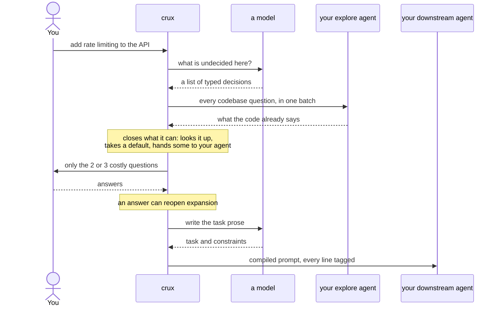
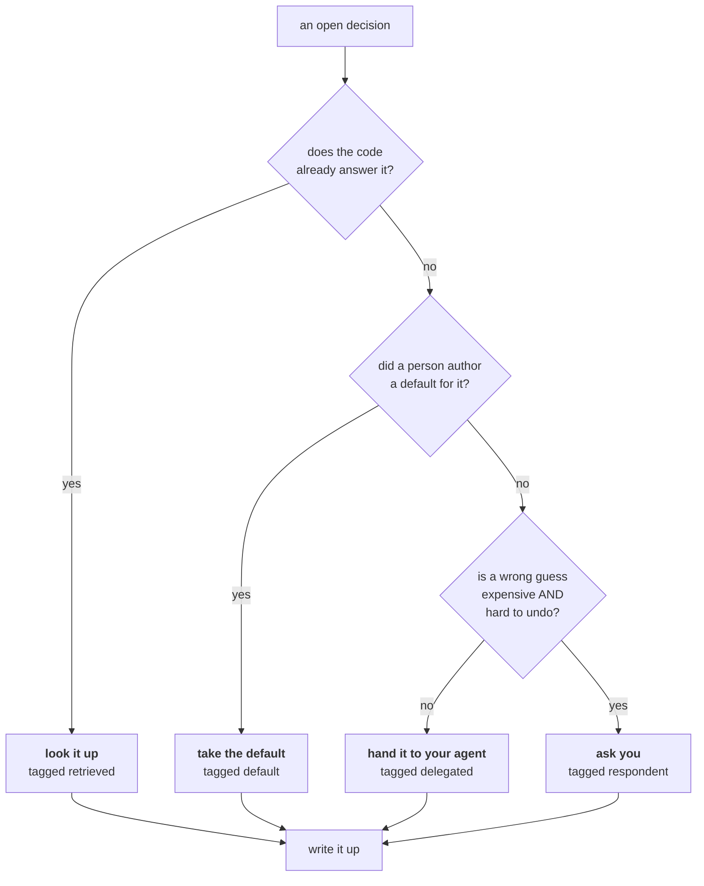

# crux

[](https://github.com/Vedanshu7/crux/actions/workflows/ci.yml)
[](LICENSE)
[](https://www.python.org/downloads/)
[](https://mypy-lang.org/)
[](https://github.com/astral-sh/ruff)

**An embeddable clarification agent.** It sits in front of the agent that does the
work, figures out what your prompt left undecided, answers most of it from your
codebase, and asks you only about the few things that are costly to get wrong.

What comes out is a prompt where every line says who decided it: you, the code, a
default, or your agent.

```python
import crux

session = crux.Crux(retriever=my_explore_agent)
state = await session.start("add notifications to the app")

while state.needs_input:
    answers = render_somewhere(state.questions)
    state = await session.resume(state.session, answers)

my_agent.run(state.compiled.render())
```

## The shape of it



crux sits in front of the agent that does the work. It never writes code. It
decides what the code should be.

**The model.** Names what is undecided, words the questions, and writes the final
task. It never decides *how* a decision gets closed. That part is plain code.

**Your explore agent.** Gets every codebase question at once, because crux works
out all of them before asking anyone anything. One trip, not one per question.

**You.** Asked last, and only where a wrong guess is both expensive and hard to
undo. Everything else is looked up, defaulted, or handed to your agent.

## How a decision gets closed

Every decision goes through the same four gates, in this order. Asking you is
the last one.



An answer can send it back to the start. Say "actually, webhooks" and crux goes
looking for what that implies.

**The one thing to take away:** asking you is the *last* of four options, not the
first. That is the whole design. A layer that asks twenty questions is a layer
people uninstall.

And because each line in the output says which of the four settled it, a guess is
visible instead of silent:

```markdown
## Decided
- Channels: in-app + email                       [respondent]
- Email via Resend, already in package.json      [retrieved]

## Assumptions. I guessed these, correct me if wrong.
- read/unread column on the notification model   [default]

## Out of scope
Retry policy, dead-letter handling, pruned by MVP scope.
```

That assumptions block is the product, not a footnote. It is derived from the
decision graph rather than written by a model, so it cannot flatter itself.

## What it is not

- **Not prompt engineering.** Almost none of the value is in wording. It is
  requirements elicitation, and the work is in deciding what to surface.
- **Not a code index.** The evidence it gathers is session-scoped: a citation
  structure for one prompt, thrown away after. Staleness and invalidation are
  your retrieval stack's problem, not ours.
- **Not an app.** There is no UI. crux yields questions and a serialized session.
  You render them however your host renders things.

## Install

```bash
uv pip install -e ".[dev]"
```

## Credentials

One key per provider you actually use, under the name that provider already uses.
litellm reads them natively, so crux does not invent a parallel scheme:

```bash
export ANTHROPIC_API_KEY=sk-ant-...
export GROQ_API_KEY=gsk_...
export CRUX_MODEL=anthropic/claude-sonnet-5
```

`CRUX_API_KEY` and `CRUX_API_BASE` exist for an OpenAI-compatible endpoint litellm
has no native route for. They are global, so crux ignores them once a fallback
chain is configured, and says so: a global key belongs to one provider and would
be wrong for every other model in the chain.

The `.env` file is read by the **CLI only**. Embedded as a library, crux never
touches your environment. Set the variables yourself, or pass a `CruxSettings`.

## Different models for different jobs

Two tiers, because the six things crux asks a model to do are not equally hard.

| Tier | Operations | Why |
|---|---|---|
| `CRUX_MODEL` | expand, adjudicate | Open-ended judgement. Naming what is undecided, and deciding what retrieved code actually settles. Where a weak model visibly fails. |
| `CRUX_WEAK_MODEL` | phrase, classify, answer_counter, draft | Bounded transformations over material already supplied. Defaults to the reasoning model, so one variable still works. |

```bash
export CRUX_MODEL=anthropic/claude-sonnet-5
export CRUX_WEAK_MODEL=groq/openai/gpt-oss-20b
export CRUX_FALLBACK_MODELS=gemini/gemini-3.6-flash,cohere_chat/command-a-03-2025
```

Drafting sits in the cheap tier deliberately: the compiled prompt's substance
comes from the decision records, and its assumptions block is derived by code
rather than written, so the model supplies only the task sentence.

For more than a couple of models there is `crux.toml`, which also carries
per-model options and per-operation overrides. Copy `crux.toml.example`.

**It beats the environment.** That is the reverse of the usual convention and it
is deliberate: a repo that checks one in wants every contributor on the same
models regardless of their shell. Credentials are the exception and cannot be set
there at all, which is what makes the inversion safe. Run `crux config` to see
what resolved and from where.

Fallbacks are tried when a model is rate limited, down, or refuses the request,
each with its own retry budget. They are **not** tried when the request itself is
malformed: that fails identically everywhere, so falling back would only burn the
chain and bury the cause.

## Try it

```bash
uv run crux clarify "add rate limiting to the API" --root ./examples/tiny_fastapi
```

Add `--headless` and it asks nothing: every open decision arrives as a stated
assumption instead. That is a supported mode, not a degraded one.

Add `--evidence ./evidence` and it writes down what it did: the expansion passes,
what retrieval found, every model exchange, and why each decision closed the way
it did.

## Where your agents plug in

crux is not a multi-agent system. It is one machine with five sockets, and you
decide what goes in them.

| Socket | What you put there | If you skip it |
|---|---|---|
| `Retriever` | **Your explore agent.** Gets a batch of briefs, returns evidence. | Ships a grep and glob default |
| `Reasoner` | Any model litellm can reach. The only one crux cannot run without. | Nothing works |
| `Clarifier` | How you ask a human. Only needed for the blocking convenience wrapper. | Runs headless |
| `SessionStore` | Anywhere JSON goes, so a session survives between rounds. | Keeps it in memory |
| `LlmClient` | Swap out litellm entirely if you have your own client. | Uses litellm |

The batching on `Retriever` is not an optimisation. Four sequential agent runs
before the first question would cost more than the mistake the whole layer exists
to prevent.

## Layout

| Path | What lives there |
|---|---|
| `src/crux/domain/` | Pure data and pure functions. No I/O, no ports, no model calls. |
| `src/crux/ports/` | The five sockets above, as Protocols. |
| `src/crux/application/` | The phase machine and the routing table. Depends on domain and ports only. |
| `src/crux/packs/` | The decision-type registry. One pack ships: software tasks. |
| `src/crux/adapters/` | The shipped implementations: litellm, filesystem retrieval, TTY, JSON store. |
| `tests/unit/` | Three tiers, split by what they fake. See `docs/code_guidelines/unit-tests.md`. |
| `tests/evals/` | Real-model measurement. Marked `live`, excluded from CI. |

## Documentation

- [`CONTRIBUTING.md`](CONTRIBUTING.md), the gate, the three test tiers, and what is most wanted.
- [`CLAUDE.md`](CLAUDE.md), the import alias table, the invariants, the vocabulary.
- [`SECURITY.md`](SECURITY.md), what is in scope and how to report it privately.
- [`docs/code_guidelines/coding-style.md`](docs/code_guidelines/coding-style.md)
- [`docs/code_guidelines/type-hints.md`](docs/code_guidelines/type-hints.md)
- [`docs/code_guidelines/unit-tests.md`](docs/code_guidelines/unit-tests.md)
- [`docs/code_guidelines/markdown.md`](docs/code_guidelines/markdown.md)

## Measurement

The decision graph's shape is committed. Its machinery is on probation, and there
is an experiment that decides its fate rather than an argument.

```bash
uv run pytest tests/evals -m live                  # decision recall, from a cassette
CRUX_RECORD=1 uv run pytest tests/evals -m live    # re-record against a real model

uv run python -m tests.evals.saturation --record   # the experiment
```

**Recall evals** score whether crux surfaced the decisions a person said mattered
and stayed quiet about the ones the repo already answers. Matching is canonical id
or token overlap, with no LLM judge, because a judge makes the harness itself
flaky. Assertions are on the aggregate, never per case, and ask rate per prompt
size has an alarm band.

**The saturation experiment** answers whether the graph earns its keep, with the
decision rule committed in advance:

| Result | What happens to the graph |
|---|---|
| mean `k* ≤ 1` **and** edge firing under 5% | Ceremony. Delete `requires` and `prunes`, keep a flat ranked list. |
| mean `k* ≥ 2` **or** edge firing over 20% | It stays, and `prunes` is what earns it. |
| Anything between | Keep `prunes` only, drop the rest. |

It also measures the number most likely to be skipped and most likely to change
the conclusion: the **noise floor**, pass one sampled three times and compared to
itself. Without it, a "new" decision on pass two might just be the model sampling
differently. When the noise floor is low the experiment prints no verdict at all
and says why.
